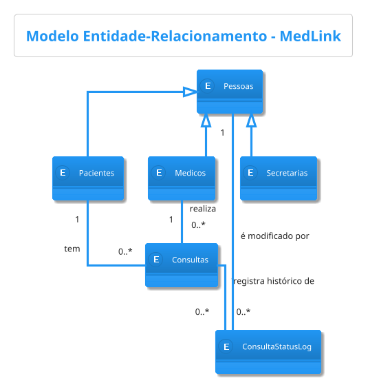
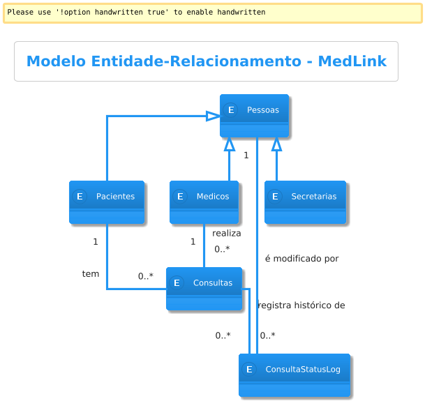
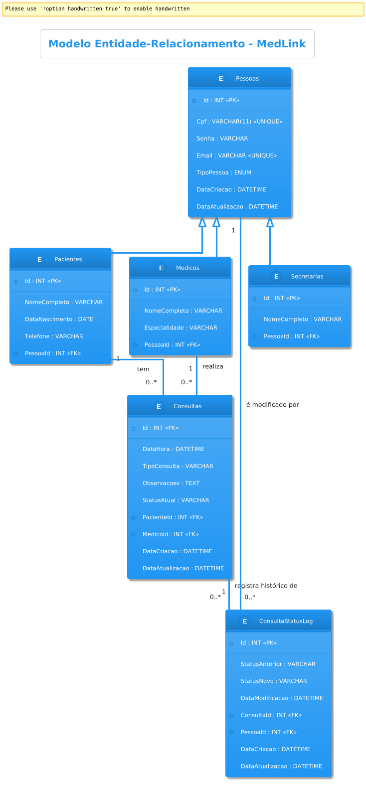

-----

# **Documentação de Banco de Dados: Sistema MedLink**

**Versão:** 1.0
**Data:** 25 de agosto de 2025

-----

## **1. Introdução**

### **1.1. Objetivo do Documento**

O presente documento tem como objetivo detalhar o projeto de banco de dados para o sistema MedLink. A documentação abrange os modelos conceitual, lógico e físico, servindo como guia para a implementação, manutenção e compreensão da estrutura de dados da aplicação.

### **1.2. Escopo do Sistema**

O **MedLink** é um sistema de gerenciamento de consultas médicas projetado para clínicas. Suas funcionalidades centrais incluem a autenticação de usuários (Secretárias, Médicos e Pacientes), agendamento e gerenciamento de consultas, e o cadastro de pacientes. A estrutura de dados foi projetada para suportar essas operações de forma segura e eficiente.

### **1.3. Metodologia**

O projeto do banco de dados seguiu uma metodologia estruturada em três fases de abstração, conforme apresentado no material de referência:

1.  **Modelo Conceitual:** Representação de alto nível das entidades e regras de negócio, independente de tecnologia.
2.  **Modelo Lógico:** Mapeamento do modelo conceitual para uma estrutura relacional, com a definição de tabelas, colunas e chaves.
3.  **Modelo Físico:** Implementação do modelo lógico em um SGBD (Sistema de Gerenciamento de Banco de Dados) específico, através da linguagem SQL.

-----

## **2. Modelo Conceitual (MER)**

O Modelo Entidade-Relacionamento (MER) descreve a estrutura de dados de forma abstrata, focando nas entidades do negócio e em como elas se relacionam.

### **2.1. Diagrama Entidade-Relacionamento (MER)**

O diagrama abaixo, gerado a partir do código PlantUML, representa visualmente o modelo conceitual do sistema MedLink.


.

### **2.2. Descrição das Entidades e Relacionamentos**

  * **Generalização/Especialização:**

      * O modelo utiliza o conceito de **Generalização/Especialização** para representar os tipos de usuários[cite: 1079, 1080]. A entidade **Pessoas** atua como uma superclasse (entidade genérica), contendo atributos comuns a todos os usuários, como as credenciais de acesso.
      * **Pacientes**, **Medicos** e **Secretarias** são subclasses (especializações) que herdam os atributos de `Pessoas` e possuem seus próprios campos específicos[cite: 1109, 1110]. A especialização é do tipo **Total**, pois toda pessoa no sistema deve pertencer a uma das três categorias.

  * **Entidade Fraca:**

      * A entidade **Consultas** é classificada como uma entidade fraca[cite: 1323]. Sua existência depende diretamente das entidades `Pacientes` e `Medicos`, não possuindo sentido de forma isolada no contexto do negócio.

  * **Aspecto Temporal (Histórico):**

      * Para garantir a rastreabilidade e a integridade do histórico, a entidade **ConsultaStatusLog** foi criada. Conforme o princípio de verificação de modelo, ela reflete o aspecto temporal dos dados, armazenando todas as alterações de status de uma consulta, ao invés de sobrescrever a informação.

-----

## **3. Modelo Lógico (Relacional)**

O modelo lógico traduz o MER para um esquema de tabelas, atributos e relacionamentos implementados por chaves primárias e estrangeiras.

.

### **3.1. Dicionário de Dados**

#### **Tabela: `Pessoas`**

*Descrição: Armazena dados comuns e credenciais de todos os usuários do sistema.*

| Coluna | Tipo de Dado | Restrições | Descrição |
| :--- | :--- | :--- | :--- |
| **Id** | `SERIAL` | **PK** | Identificador único da pessoa. |
| **Cpf** | `VARCHAR(11)` | `UNIQUE, NOT NULL` | CPF do usuário, usado para login. |
| **Senha** | `VARCHAR(255)` | `NOT NULL` | Senha do usuário (deve ser armazenada com hash). |
| **Email** | `VARCHAR(255)` | `UNIQUE` | E-mail do usuário. |
| **TipoPessoa** | `VARCHAR(20)` | `NOT NULL` | Define o perfil ('PACIENTE', 'MEDICO', 'SECRETARIA'). |
| **DataCriacao** | `TIMESTAMP` | `NOT NULL` | Data e hora de criação do registro. |
| **DataAtualizacao** | `TIMESTAMP` | `NOT NULL` | Data e hora da última atualização do registro. |

#### **Tabela: `Pacientes`**

*Descrição: Armazena dados específicos dos pacientes.*

| Coluna | Tipo de Dado | Restrições | Descrição |
| :--- | :--- | :--- | :--- |
| **Id** | `SERIAL` | **PK** | Identificador único do paciente. |
| **NomeCompleto** | `VARCHAR(255)` | `NOT NULL` | Nome completo do paciente. |
| **DataNascimento** | `DATE` | `NOT NULL` | Data de nascimento do paciente. |
| **Telefone** | `VARCHAR(20)` | `NOT NULL` | Telefone de contato do paciente. |
| **PessoaId** | `INTEGER` | **FK** (Pessoas.Id) | Chave estrangeira que liga ao registro em `Pessoas`. |

#### **Tabela: `Medicos`**

*Descrição: Armazena dados específicos dos médicos.*

| Coluna | Tipo de Dado | Restrições | Descrição |
| :--- | :--- | :--- | :--- |
| **Id** | `SERIAL` | **PK** | Identificador único do médico. |
| **NomeCompleto** | `VARCHAR(255)` | `NOT NULL` | Nome completo do médico. |
| **Especialidade** | `VARCHAR(100)`| | Especialidade médica. |
| **PessoaId** | `INTEGER` | **FK** (Pessoas.Id) | Chave estrangeira que liga ao registro em `Pessoas`. |

#### **Tabela: `Secretarias`**

*Descrição: Armazena dados específicos das secretárias.*

| Coluna | Tipo de Dado | Restrições | Descrição |
| :--- | :--- | :--- | :--- |
| **Id** | `SERIAL` | **PK** | Identificador único da secretária. |
| **NomeCompleto** | `VARCHAR(255)` | `NOT NULL` | Nome completo da secretária. |
| **PessoaId** | `INTEGER` | **FK** (Pessoas.Id) | Chave estrangeira que liga ao registro em `Pessoas`. |

#### **Tabela: `Consultas`**

*Descrição: Armazena as informações dos agendamentos.*

| Coluna | Tipo de Dado | Restrições | Descrição |
| :--- | :--- | :--- | :--- |
| **Id** | `SERIAL` | **PK** | Identificador único da consulta. |
| **DataHora** | `TIMESTAMP` | `NOT NULL` | Data e hora marcadas para a consulta. |
| **StatusAtual** | `VARCHAR(50)` | `NOT NULL` | O último status válido da consulta (ex: 'PENDENTE'). |
| **PacienteId** | `INTEGER` | **FK** (Pacientes.Id) | Identifica o paciente da consulta. |
| **MedicoId** | `INTEGER` | **FK** (Medicos.Id) | Identifica o médico da consulta. |

#### **Tabela: `ConsultaStatusLog`**

*Descrição: Tabela de auditoria para registrar todas as mudanças de status das consultas.*

| Coluna | Tipo de Dado | Restrições | Descrição |
| :--- | :--- | :--- | :--- |
| **Id** | `SERIAL` | **PK** | Identificador único do registro de log. |
| **StatusNovo** | `VARCHAR(50)` | `NOT NULL` | O novo status atribuído à consulta. |
| **DataModificacao** | `TIMESTAMP` | `NOT NULL` | Momento exato da mudança. |
| **ConsultaId** | `INTEGER` | **FK** (Consultas.Id) | Identifica a consulta modificada. |
| **PessoaId** | `INTEGER` | **FK** (Pessoas.Id) | Identifica o usuário que fez a alteração. |

-----

## **4. Modelo Físico (Script SQL - DDL)**

Este script DDL (Data Definition Language) contém os comandos `CREATE TABLE` para construir a estrutura do banco de dados em um SGBD PostgreSQL.

```sql
-- Tabela central para autenticação e dados comuns
CREATE TABLE Pessoas (
    Id SERIAL PRIMARY KEY,
    Cpf VARCHAR(11) NOT NULL UNIQUE,
    Senha VARCHAR(255) NOT NULL,
    Email VARCHAR(255) UNIQUE,
    TipoPessoa VARCHAR(20) NOT NULL CHECK (TipoPessoa IN ('PACIENTE', 'MEDICO', 'SECRETARIA')),
    DataCriacao TIMESTAMP NOT NULL DEFAULT CURRENT_TIMESTAMP,
    DataAtualizacao TIMESTAMP NOT NULL DEFAULT CURRENT_TIMESTAMP
);

-- Tabela com dados específicos de pacientes
CREATE TABLE Pacientes (
    Id SERIAL PRIMARY KEY,
    NomeCompleto VARCHAR(255) NOT NULL,
    DataNascimento DATE NOT NULL,
    Telefone VARCHAR(20) NOT NULL,
    PessoaId INTEGER NOT NULL UNIQUE,
    FOREIGN KEY (PessoaId) REFERENCES Pessoas(Id) ON DELETE CASCADE
);

-- Tabela com dados específicos de médicos
CREATE TABLE Medicos (
    Id SERIAL PRIMARY KEY,
    NomeCompleto VARCHAR(255) NOT NULL,
    Especialidade VARCHAR(100),
    PessoaId INTEGER NOT NULL UNIQUE,
    FOREIGN KEY (PessoaId) REFERENCES Pessoas(Id) ON DELETE CASCADE
);

-- Tabela com dados específicos de secretárias
CREATE TABLE Secretarias (
    Id SERIAL PRIMARY KEY,
    NomeCompleto VARCHAR(255) NOT NULL,
    PessoaId INTEGER NOT NULL UNIQUE,
    FOREIGN KEY (PessoaId) REFERENCES Pessoas(Id) ON DELETE CASCADE
);

-- Tabela de agendamentos
CREATE TABLE Consultas (
    Id SERIAL PRIMARY KEY,
    DataHora TIMESTAMP NOT NULL,
    StatusAtual VARCHAR(50) NOT NULL,
    PacienteId INTEGER NOT NULL,
    MedicoId INTEGER NOT NULL,
    DataCriacao TIMESTAMP NOT NULL DEFAULT CURRENT_TIMESTAMP,
    DataAtualizacao TIMESTAMP NOT NULL DEFAULT CURRENT_TIMESTAMP,
    FOREIGN KEY (PacienteId) REFERENCES Pacientes(Id),
    FOREIGN KEY (MedicoId) REFERENCES Medicos(Id)
);

-- Tabela de log para o histórico de status das consultas
CREATE TABLE ConsultaStatusLog (
    Id SERIAL PRIMARY KEY,
    StatusNovo VARCHAR(50) NOT NULL,
    DataModificacao TIMESTAMP NOT NULL DEFAULT CURRENT_TIMESTAMP,
    ConsultaId INTEGER NOT NULL,
    PessoaId INTEGER, -- O usuário que realizou a mudança
    FOREIGN KEY (ConsultaId) REFERENCES Consultas(Id) ON DELETE CASCADE,
    FOREIGN KEY (PessoaId) REFERENCES Pessoas(Id) ON DELETE SET NULL
);
```

-----

## **5. Implementação de Gatilhos (Triggers)**

Esta seção contém os scripts SQL (DDL) para a criação dos gatilhos (triggers) no SGBD PostgreSQL. Os triggers automatizam regras de negócio diretamente no banco de dados, garantindo a integridade e a rastreabilidade dos dados.

*Estes scripts devem ser executados após a criação das tabelas.*

### **5.1. Trigger para Atualização Automática de `DataAtualizacao`**

Para garantir que o campo `DataAtualizacao` seja sempre atualizado, criamos uma função genérica que pode ser associada a múltiplas tabelas.

#### **Passo 1: Criar a Função**

```sql
/*
 * FUNÇÃO: update_data_atualizacao_column()
 * DESCRIÇÃO: Esta função genérica atualiza a coluna 'DataAtualizacao'
 * para o timestamp atual sempre que um registro é modificado.
 * RETORNO: O registro modificado (NEW).
 */
CREATE OR REPLACE FUNCTION update_data_atualizacao_column()
RETURNS TRIGGER AS $$
BEGIN
   NEW.DataAtualizacao = NOW();
   RETURN NEW;
END;
$$ language 'plpgsql';
```

#### **Passo 2: Associar a Função às Tabelas**

A função é então vinculada ao evento `BEFORE UPDATE` de cada tabela relevante.

```sql
-- Trigger para a tabela Pessoas
CREATE TRIGGER trg_update_pessoas_data_atualizacao
BEFORE UPDATE ON Pessoas
FOR EACH ROW
EXECUTE FUNCTION update_data_atualizacao_column();

-- Trigger para a tabela Consultas
CREATE TRIGGER trg_update_consultas_data_atualizacao
BEFORE UPDATE ON Consultas
FOR EACH ROW
EXECUTE FUNCTION update_data_atualizacao_column();

-- Trigger para a tabela ConsultaStatusLog
CREATE TRIGGER trg_update_log_data_atualizacao
BEFORE UPDATE ON ConsultaStatusLog
FOR EACH ROW
EXECUTE FUNCTION update_data_atualizacao_column();
```

-----

### **5.2. Trigger para Log de Mudança de Status da Consulta**

Este gatilho garante que toda alteração no status de uma consulta seja registrada na tabela `ConsultaStatusLog`.

#### **Passo 1: Criar a Função**

A função verifica se o valor do status foi realmente alterado antes de criar um novo registro de log.

```sql
/*
 * FUNÇÃO: log_consulta_status_change()
 * DESCRIÇÃO: Verifica se o status de uma consulta foi alterado. Se sim,
 * insere um novo registro na tabela de log com o status novo.
 * RETORNO: O registro modificado (NEW).
 */
CREATE OR REPLACE FUNCTION log_consulta_status_change()
RETURNS TRIGGER AS $$
BEGIN
    -- Compara o status antigo (OLD) com o novo (NEW) para evitar logs desnecessários
    IF NEW.StatusAtual IS DISTINCT FROM OLD.StatusAtual THEN
        
        -- Insere o registro de log
        INSERT INTO ConsultaStatusLog(ConsultaId, StatusNovo, DataModificacao, PessoaId)
        VALUES(NEW.Id, NEW.StatusAtual, NOW(), NULL);
        
        -- NOTA: O 'PessoaId' é inserido como NULL. A identificação do usuário
        -- que fez a alteração geralmente é gerenciada e passada pela camada 
        -- de aplicação, pois o banco de dados não tem esse contexto.
    END IF;

    RETURN NEW;
END;
$$ language 'plpgsql';
```

#### **Passo 2: Associar a Função à Tabela `Consultas`**

```sql
-- Trigger para a tabela Consultas
CREATE TRIGGER trg_log_consulta_status_change
BEFORE UPDATE ON Consultas
FOR EACH ROW
EXECUTE FUNCTION log_consulta_status_change();
```