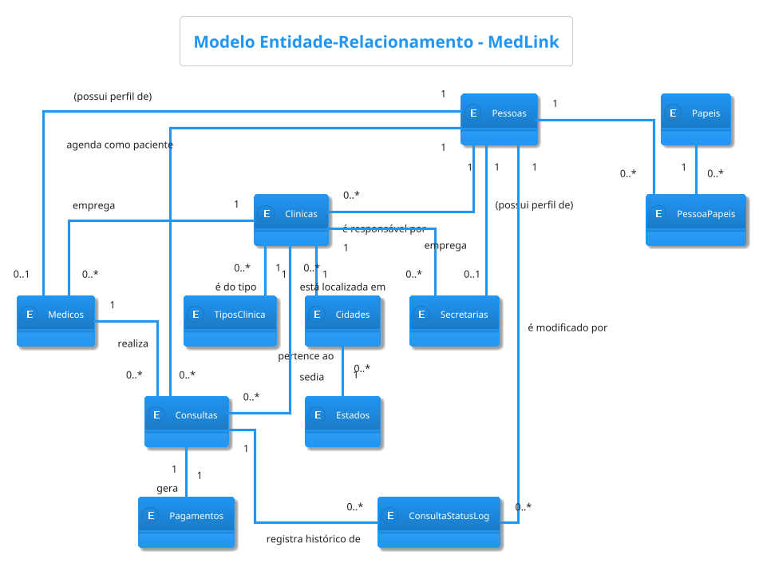
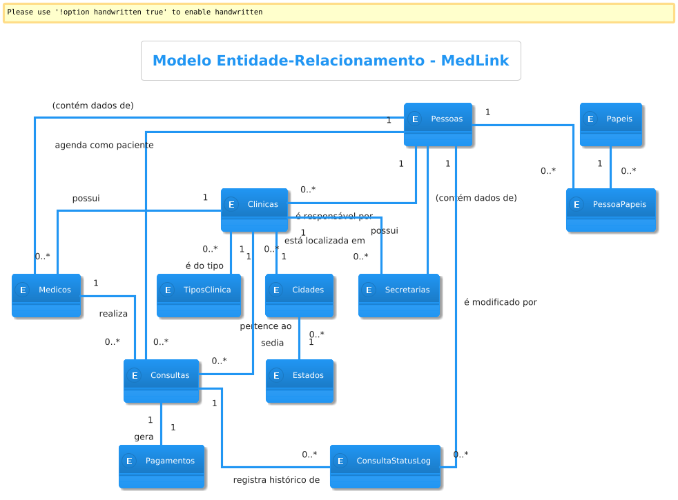

# **Documentação de Banco de Dados: Sistema MedLink**

**Versão:** 5.0
**Data:** 29 de agosto de 2025

## **1. Introdução**

### **1.1. Objetivo do Documento**

O presente documento detalha o projeto de banco de dados para o sistema MedLink. Ele serve como o guia técnico definitivo para a equipe de desenvolvimento, abrangendo os modelos conceitual, lógico e físico. O design foi concebido para otimizar a integração com ferramentas de Mapeamento Objeto-Relacional (ORM), centralizar a lógica de negócio na aplicação e garantir alta performance, segurança e escalabilidade.

### **1.2. Escopo do Sistema**

O **MedLink** é um sistema de gerenciamento de consultas médicas projetado para suportar múltiplas clínicas e perfis de usuários (`Paciente`, `Secretaria`, `Médico`, `Admin`, `Financeiro`). O modelo de dados trata toda pessoa como uma entidade central, cujas capacidades no sistema são definidas pelos papéis que lhe são atribuídos.

## **2. Modelo Conceitual (MER)**

O modelo de dados foi projetado para ser flexível e escalável. A entidade `Pessoas` é central, representando qualquer indivíduo no sistema. As permissões e capacidades de cada pessoa são gerenciadas por um sistema de papéis desacoplado, e cada clínica possui um responsável designado. As entidades `Medicos` e `Secretarias` são tratadas como entidades fracas, pois sua existência depende da entidade `Pessoas`.

### **2.1. Diagrama Entidade-Relacionamento (MER)**





## **3. Modelo Lógico (Relacional)**

O modelo lógico traduz o MER para um esquema de tabelas, atributos e relacionamentos implementados por chaves primárias e estrangeiras.

### **3.1. Dicionário de Dados Completo**

#### **Tabela: `Pessoas`**
*Descrição: Tabela central que armazena dados comuns e pessoais de todos os indivíduos no sistema.*
| Coluna | Tipo de Dado | Restrições | Descrição |
| :--- | :--- | :--- | :--- |
| **Id** | `SERIAL` | **PK** | Identificador único da pessoa. |
| **NomeCompleto**| `VARCHAR(255)`| `NOT NULL` | Nome completo do indivíduo. |
| **Cpf** | `VARCHAR(11)` | `UNIQUE, NOT NULL` | CPF do usuário, usado para login. |
| **Email** | `VARCHAR(255)` | `UNIQUE` | E-mail do usuário. |
| **Senha** | `VARCHAR(255)` | `NOT NULL` | Senha do usuário (armazenada com hash). |
| **DataNascimento**| `DATE` | | Data de nascimento. |
| **Telefone** | `VARCHAR(20)` | | Telefone de contato. |
| **DataCriacao**| `TIMESTAMP` | `NOT NULL` | Data de criação do registro. |
| **DataAtualizacao**| `TIMESTAMP` | `NOT NULL` | Data da última atualização. |

#### **Tabela: `Papeis`**
*Descrição: Tabela de referência para os papéis de usuário disponíveis no sistema.*
| Coluna | Tipo de Dado | Restrições | Descrição |
| :--- | :--- | :--- | :--- |
| **Id** | `SERIAL` | **PK** | Identificador único do papel. |
| **Nome** | `VARCHAR(50)` | `NOT NULL, UNIQUE` | Nome do papel (ex: 'PACIENTE', 'ADMIN'). |
| **Descricao** | `TEXT` | | Descrição das responsabilidades do papel. |

#### **Tabela: `PessoaPapeis`**
*Descrição: Tabela associativa que vincula usuários a papéis, com chave primária simples para facilitar o mapeamento ORM.*
| Coluna | Tipo de Dado | Restrições | Descrição |
| :--- | :--- | :--- | :--- |
| **Id** | `SERIAL` | **PK** | Identificador único da atribuição. |
| **PessoaId** | `INTEGER` | **FK** (Pessoas.Id) | Identificador do usuário. |
| **PapelId** | `INTEGER` | **FK** (Papeis.Id) | Identificador do papel atribuído. |
| *Constraint* | `UNIQUE` | `(PessoaId, PapelId)` | Garante que um papel não seja atribuído duas vezes à mesma pessoa. |

#### **Tabela: `Estados`**
*Descrição: Tabela de referência para os estados brasileiros.*
| Coluna | Tipo de Dado | Restrições | Descrição |
| :--- | :--- | :--- | :--- |
| **Id** | `SERIAL` | **PK** | Identificador único do estado. |
| **Nome** | `VARCHAR(50)` | `NOT NULL, UNIQUE` | Nome do estado. |
| **Uf** | `CHAR(2)` | `NOT NULL, UNIQUE` | Sigla do estado. |

#### **Tabela: `Cidades`**
*Descrição: Tabela de referência para as cidades, vinculadas a um estado.*
| Coluna | Tipo de Dado | Restrições | Descrição |
| :--- | :--- | :--- | :--- |
| **Id** | `SERIAL` | **PK** | Identificador único da cidade. |
| **Nome** | `VARCHAR(100)`| `NOT NULL` | Nome da cidade. |
| **EstadoId** | `INTEGER` | **FK** (Estados.Id) | Chave estrangeira para `Estados`. |

#### **Tabela: `TiposClinica`**
*Descrição: Tabela de referência para os tipos de clínica (ex: 'Odontologia', 'Cardiologia').*
| Coluna | Tipo de Dado | Restrições | Descrição |
| :--- | :--- | :--- | :--- |
| **Id** | `SERIAL` | **PK** | Identificador único do tipo. |
| **Descricao** | `VARCHAR(100)`| `NOT NULL, UNIQUE` | Descrição do tipo de clínica. |

#### **Tabela: `Clinicas`**
*Descrição: Armazena os dados cadastrais de cada clínica com endereço estruturado e um responsável designado.*
| Coluna | Tipo de Dado | Restrições | Descrição |
| :--- | :--- | :--- | :--- |
| **Id** | `SERIAL` | **PK** | Identificador único da clínica. |
| **NomeFantasia**| `VARCHAR(255)` | `NOT NULL` | Nome comercial da clínica. |
| **Cnpj** | `VARCHAR(14)` | `UNIQUE, NOT NULL`| CNPJ da clínica. |
| **Logradouro** | `VARCHAR(255)`| | Rua, avenida, etc. |
| **Numero** | `VARCHAR(20)` | | Número do endereço. |
| **Bairro** | `VARCHAR(100)`| | Bairro do endereço. |
| **Cep** | `VARCHAR(8)` | | Código de Endereçamento Postal. |
| **Telefone** | `VARCHAR(20)` | | Telefone de contato principal. |
| **CidadeId** | `INTEGER` | **FK** (Cidades.Id) | Chave estrangeira para `Cidades`. |
| **TipoClinicaId**| `INTEGER` | **FK** (TiposClinica.Id)| Chave estrangeira para `TiposClinica`. |
| **ResponsavelPessoaId**| `INTEGER` | **FK** (Pessoas.Id)| Identifica o usuário responsável pela clínica. |
| **DataCriacao**| `TIMESTAMP` | `NOT NULL` | Data de criação do registro. |
| **DataAtualizacao**| `TIMESTAMP` | `NOT NULL` | Data da última atualização. |

#### **Tabela: `Medicos`**
*Descrição: Entidade fraca que armazena dados específicos do perfil de médico, cuja existência depende de uma Pessoa.*
| Coluna | Tipo de Dado | Restrições | Descrição |
| :--- | :--- | :--- | :--- |
| **PessoaId** | `INTEGER` | **PK, FK** (Pessoas.Id) | Identificador da Pessoa. Atua como Chave Primária e Estrangeira. |
| **Especialidade**| `VARCHAR(100)`| | Especialidade médica. |
| **ClinicaId** | `INTEGER` | `NOT NULL`, **FK** (Clinicas.Id)| Identifica a clínica onde o médico atua. |

#### **Tabela: `Secretarias`**
*Descrição: Entidade fraca que armazena dados específicos do perfil de secretária, cuja existência depende de uma Pessoa.*
| Coluna | Tipo de Dado | Restrições | Descrição |
| :--- | :--- | :--- | :--- |
| **PessoaId** | `INTEGER` | **PK, FK** (Pessoas.Id) | Identificador da Pessoa. Atua como Chave Primária e Estrangeira. |
| **ClinicaId** | `INTEGER` | `NOT NULL`, **FK** (Clinicas.Id)| Identifica a clínica onde a secretária trabalha. |

#### **Tabela: `Consultas`**
*Descrição: Armazena as informações dos agendamentos e o valor acordado.*
| Coluna | Tipo de Dado | Restrições | Descrição |
| :--- | :--- | :--- | :--- |
| **Id** | `SERIAL` | **PK** | Identificador único da consulta. |
| **DataHora** | `TIMESTAMP` | `NOT NULL` | Data e hora da consulta. |
| **StatusAtual** | `VARCHAR(50)` | `NOT NULL` | Último status válido da consulta. |
| **Valor** | `DECIMAL(10, 2)` | `NOT NULL` | Valor da consulta cobrado no momento do agendamento. |
| **PacientePessoaId**| `INTEGER` | **FK** (Pessoas.Id)| Identifica a pessoa (paciente). |
| **MedicoPessoaId** | `INTEGER` | **FK** (Medicos.PessoaId) | Identifica o perfil do médico. |
| **ClinicaId** | `INTEGER` | **FK** (Clinicas.Id)| Identifica a clínica da consulta. |
| **DataCriacao**| `TIMESTAMP` | `NOT NULL` | Data de criação do registro. |
| **DataAtualizacao**| `TIMESTAMP` | `NOT NULL` | Data da última atualização. |

#### **Tabela: `Pagamentos`**
*Descrição: Armazena os detalhes financeiros de cada consulta.*
| Coluna | Tipo de Dado | Restrições | Descrição |
| :--- | :--- | :--- | :--- |
| **Id** | `SERIAL` | **PK** | Identificador único do pagamento. |
| **ConsultaId** | `INTEGER` | `UNIQUE, FK` (Consultas.Id) | Chave estrangeira que liga o pagamento a uma única consulta. |
| **ValorPago** | `DECIMAL(10, 2)` | | Valor efetivamente pago. Pode ser diferente do valor da consulta. |
| **Status** | `VARCHAR(50)` | `NOT NULL` | Status do pagamento (PENDENTE, PAGO, CANCELADO, FALHOU). |
| **Metodo** | `VARCHAR(50)` | | Método de pagamento (CARTAO_CREDITO, PIX, DINHEIRO). |
| **DataPagamento**| `TIMESTAMP` | | Data e hora em que o pagamento foi confirmado. |
| **IdTransacaoExterna** | `VARCHAR(255)` | `UNIQUE` | ID da transação no gateway de pagamento para reconciliação. |
| **DataCriacao**| `TIMESTAMP` | `NOT NULL` | Data de criação do registro. |
| **DataAtualizacao**| `TIMESTAMP` | `NOT NULL` | Data da última atualização. |

#### **Tabela: `ConsultaStatusLog`**
*Descrição: Tabela de auditoria para o histórico de status das consultas.*
| Coluna | Tipo de Dado | Restrições | Descrição |
| :--- | :--- | :--- | :--- |
| **Id** | `SERIAL` | **PK** | Identificador único do log. |
| **StatusNovo** | `VARCHAR(50)` | `NOT NULL` | O novo status atribuído. |
| **DataModificacao**| `TIMESTAMP` | `NOT NULL` | Momento da mudança. |
| **ConsultaId** | `INTEGER` | **FK** (Consultas.Id)| Identifica a consulta modificada. |
| **PessoaId** | `INTEGER` | **FK** (Pessoas.Id) | Identifica o usuário que fez a alteração. |

---

## **4. Modelo Físico (Script SQL - DDL)**

Este script DDL unificado contém todos os comandos para construir a estrutura completa do banco de dados em PostgreSQL.

```sql
-- =========== CRIAÇÃO DAS TABELAS ===========

-- Tabela central para dados pessoais e de autenticação
CREATE TABLE Pessoas (
    Id SERIAL PRIMARY KEY,
    NomeCompleto VARCHAR(255) NOT NULL,
    Cpf VARCHAR(11) NOT NULL UNIQUE,
    Email VARCHAR(255) UNIQUE,
    Senha VARCHAR(255) NOT NULL,
    DataNascimento DATE,
    Telefone VARCHAR(20),
    DataCriacao TIMESTAMP NOT NULL DEFAULT CURRENT_TIMESTAMP,
    DataAtualizacao TIMESTAMP NOT NULL DEFAULT CURRENT_TIMESTAMP
);

-- Tabelas de Controle de Acesso Baseado em Papéis (RBAC)
CREATE TABLE Papeis (
    Id SERIAL PRIMARY KEY,
    Nome VARCHAR(50) NOT NULL UNIQUE,
    Descricao TEXT
);

CREATE TABLE PessoaPapeis (
    Id SERIAL PRIMARY KEY,
    PessoaId INTEGER NOT NULL,
    PapelId INTEGER NOT NULL,
    UNIQUE (PessoaId, PapelId),
    FOREIGN KEY (PessoaId) REFERENCES Pessoas(Id) ON DELETE CASCADE,
    FOREIGN KEY (PapelId) REFERENCES Papeis(Id) ON DELETE CASCADE
);

-- Tabelas de Referência (Lookup Tables)
CREATE TABLE Estados (
    Id SERIAL PRIMARY KEY,
    Nome VARCHAR(50) NOT NULL UNIQUE,
    Uf CHAR(2) NOT NULL UNIQUE
);

CREATE TABLE Cidades (
    Id SERIAL PRIMARY KEY,
    Nome VARCHAR(100) NOT NULL,
    EstadoId INTEGER NOT NULL,
    FOREIGN KEY (EstadoId) REFERENCES Estados(Id) ON DELETE RESTRICT
);

CREATE TABLE TiposClinica (
    Id SERIAL PRIMARY KEY,
    Descricao VARCHAR(100) NOT NULL UNIQUE
);

-- Tabela principal de Clínicas
CREATE TABLE Clinicas (
    Id SERIAL PRIMARY KEY,
    NomeFantasia VARCHAR(255) NOT NULL,
    Cnpj VARCHAR(14) NOT NULL UNIQUE,
    Logradouro VARCHAR(255),
    Numero VARCHAR(20),
    Bairro VARCHAR(100),
    Cep VARCHAR(8),
    Telefone VARCHAR(20),
    CidadeId INTEGER NOT NULL,
    TipoClinicaId INTEGER NOT NULL,
    ResponsavelPessoaId INTEGER,
    DataCriacao TIMESTAMP NOT NULL DEFAULT CURRENT_TIMESTAMP,
    DataAtualizacao TIMESTAMP NOT NULL DEFAULT CURRENT_TIMESTAMP,
    FOREIGN KEY (CidadeId) REFERENCES Cidades(Id) ON DELETE RESTRICT,
    FOREIGN KEY (TipoClinicaId) REFERENCES TiposClinica(Id) ON DELETE RESTRICT,
    FOREIGN KEY (ResponsavelPessoaId) REFERENCES Pessoas(Id) ON DELETE SET NULL
);

-- Tabelas com dados específicos de perfis (Entidades Fracas)
CREATE TABLE Medicos (
    PessoaId INTEGER PRIMARY KEY,
    Especialidade VARCHAR(100),
    ClinicaId INTEGER NOT NULL,
    FOREIGN KEY (PessoaId) REFERENCES Pessoas(Id) ON DELETE CASCADE,
    FOREIGN KEY (ClinicaId) REFERENCES Clinicas(Id) ON DELETE RESTRICT
);

CREATE TABLE Secretarias (
    PessoaId INTEGER PRIMARY KEY,
    ClinicaId INTEGER NOT NULL,
    FOREIGN KEY (PessoaId) REFERENCES Pessoas(Id) ON DELETE CASCADE,
    FOREIGN KEY (ClinicaId) REFERENCES Clinicas(Id) ON DELETE RESTRICT
);

-- Tabela de transações de Consultas
CREATE TABLE Consultas (
    Id SERIAL PRIMARY KEY,
    DataHora TIMESTAMP NOT NULL,
    StatusAtual VARCHAR(50) NOT NULL,
    Valor DECIMAL(10, 2) NOT NULL,
    PacientePessoaId INTEGER NOT NULL,
    MedicoPessoaId INTEGER NOT NULL,
    ClinicaId INTEGER NOT NULL,
    DataCriacao TIMESTAMP NOT NULL DEFAULT CURRENT_TIMESTAMP,
    DataAtualizacao TIMESTAMP NOT NULL DEFAULT CURRENT_TIMESTAMP,
    FOREIGN KEY (PacientePessoaId) REFERENCES Pessoas(Id) ON DELETE CASCADE,
    FOREIGN KEY (MedicoPessoaId) REFERENCES Medicos(PessoaId) ON DELETE RESTRICT,
    FOREIGN KEY (ClinicaId) REFERENCES Clinicas(Id) ON DELETE RESTRICT
);

-- Tabela de Pagamentos
CREATE TABLE Pagamentos (
    Id SERIAL PRIMARY KEY,
    ConsultaId INTEGER NOT NULL UNIQUE,
    ValorPago DECIMAL(10, 2),
    Status VARCHAR(50) NOT NULL CHECK (Status IN ('PENDENTE', 'PAGO', 'CANCELADO', 'FALHOU')),
    Metodo VARCHAR(50),
    DataPagamento TIMESTAMP,
    IdTransacaoExterna VARCHAR(255) UNIQUE,
    DataCriacao TIMESTAMP NOT NULL DEFAULT CURRENT_TIMESTAMP,
    DataAtualizacao TIMESTAMP NOT NULL DEFAULT CURRENT_TIMESTAMP,
    FOREIGN KEY (ConsultaId) REFERENCES Consultas(Id) ON DELETE CASCADE
);

-- Tabela de auditoria para o histórico de status das consultas
CREATE TABLE ConsultaStatusLog (
    Id SERIAL PRIMARY KEY,
    StatusNovo VARCHAR(50) NOT NULL,
    DataModificacao TIMESTAMP NOT NULL DEFAULT CURRENT_TIMESTAMP,
    ConsultaId INTEGER NOT NULL,
    PessoaId INTEGER,
    FOREIGN KEY (ConsultaId) REFERENCES Consultas(Id) ON DELETE CASCADE,
    FOREIGN KEY (PessoaId) REFERENCES Pessoas(Id) ON DELETE SET NULL
);


-- =========== CRIAÇÃO DOS ÍNDICES ===========
CREATE INDEX idx_pessoapapeis_pessoaid ON PessoaPapeis(PessoaId);
CREATE INDEX idx_pessoapapeis_papelid ON PessoaPapeis(PapelId);
CREATE INDEX idx_cidades_estadoid ON Cidades(EstadoId);
CREATE INDEX idx_clinicas_cidadeid ON Clinicas(CidadeId);
CREATE INDEX idx_clinicas_tipoclinicaid ON Clinicas(TipoClinicaId);
CREATE INDEX idx_clinicas_responsavelid ON Clinicas(ResponsavelPessoaId);
CREATE INDEX idx_medicos_clinicaid ON Medicos(ClinicaId);
CREATE INDEX idx_secretarias_clinicaid ON Secretarias(ClinicaId);
CREATE INDEX idx_consultas_pacienteid ON Consultas(PacientePessoaId);
CREATE INDEX idx_consultas_medicoid ON Consultas(MedicoPessoaId);
CREATE INDEX idx_consultas_clinicaid ON Consultas(ClinicaId);
CREATE INDEX idx_pagamentos_consultaid ON Pagamentos(ConsultaId);
CREATE INDEX idx_pagamentos_idtransacaoexterna ON Pagamentos(IdTransacaoExterna);
CREATE INDEX idx_consultastatuslog_consultaid ON ConsultaStatusLog(ConsultaId);
CREATE INDEX idx_consultastatuslog_pessoaid ON ConsultaStatusLog(PessoaId);


-- =========== DADOS INICIAIS (SEEDS) ===========
INSERT INTO Papeis (Nome, Descricao) VALUES
('PACIENTE', 'Acesso via aplicativo mobile para agendamento e visualização de consultas.'),
('SECRETARIA', 'Acesso web para gerenciamento de agendas, pacientes e consultas.'),
('MEDICO', 'Acesso web para visualização de agenda e histórico de pacientes.'),
('ADMIN', 'Acesso total às configurações do sistema e gerenciamento de usuários.'),
('FINANCEIRO', 'Acesso web para gerenciamento de faturamento e relatórios financeiros.');
```

---

## **5. Arquitetura de Permissões e Acesso**

O modelo de dados foi projetado para suportar nativamente as regras de permissão do sistema, utilizando um sistema de Controle de Acesso Baseado em Papéis (RBAC).

* **Fundamento:** O acesso não é definido pela tabela `Pessoas`, mas sim pela combinação de registros nas tabelas `Pessoas`, `Papeis` e `PessoaPapeis`. Isso garante que cada ação no sistema possa ser validada de forma granular.

* **Implementação no Backend:** Cada endpoint da API é a principal barreira de segurança. Antes de executar qualquer lógica de negócio, o backend **deve** validar se o `PessoaId` do usuário autenticado está associado ao `PapelId` necessário para aquela operação. Uma falha nessa verificação deve resultar em uma resposta de "Acesso Negado" (HTTP 403).

* **Implementação no Flutter Web (RBAC):** Após o login, a aplicação web deve obter a lista de papéis do usuário autenticado. Essa lista deve ser mantida no estado da aplicação e utilizada para renderizar condicionalmente componentes da interface. Menus, botões e telas inteiras só devem ser exibidos se o usuário possuir o papel apropriado.

* **Implementação no Flutter Mobile:** O fluxo é simplificado. No momento do login, o backend deve verificar se o usuário possui o papel 'PACIENTE'. Se não possuir, o login deve ser negado para a plataforma mobile. Se possuir, a aplicação pode operar com a garantia de que o usuário é um paciente, embora o backend continue validando cada ação.

---

## **6. Justificativas das Escolhas de Design**

* **Centralização de Dados Pessoais:** A consolidação de atributos na tabela `Pessoas` simplifica o modelo, elimina redundância e reflete a realidade de que qualquer indivíduo pode ser um paciente. A distinção de um papel é feita por uma atribuição lógica, não por uma estrutura de tabela separada.

* **Modelo RBAC:** A implementação de um sistema de papéis (`Papeis`, `PessoaPapeis`) aumenta a flexibilidade e escalabilidade, permitindo que um usuário desempenhe múltiplos papéis e que novos papéis sejam adicionados sem alterações na estrutura do banco.

* **Separação de Domínios (Pagamentos):** A criação de uma tabela `Pagamentos` dedicada, separada de `Consultas`, isola as responsabilidades financeiras. Isso aumenta a segurança, simplifica a lógica de negócio de cada domínio e permite que o sistema financeiro evolua (ex: para suportar parcelamentos) sem impactar a estrutura de agendamentos.

* **Entidades Fracas para Perfis:** As tabelas `Medicos` e `Secretarias` foram modeladas como entidades fracas, utilizando `PessoaId` como chave primária e estrangeira. Isso reforça conceitualmente que um perfil de médico ou secretária não pode existir sem uma pessoa, além de otimizar a estrutura da tabela e as buscas.

* **Otimização para ORM:** O uso de chaves primárias simples em tabelas associativas (`PessoaPapeis`) e a remoção de gatilhos (triggers) simplificam o mapeamento e a lógica na camada da aplicação, centralizando as regras de negócio e facilitando os testes.

---

## **7. Boas Práticas para Desenvolvedores**

* **Responsabilidade da Aplicação na Auditoria:** A aplicação é **totalmente responsável** por definir os valores de `DataCriacao` e `DataAtualizacao` e por criar explicitamente os registros na `ConsultaStatusLog` dentro da mesma transação em que o status de uma `Consulta` é alterado.

* **Transações Financeiras:** Todas as operações que envolvem a criação de uma `Consulta` e seu respectivo `Pagamento` devem ocorrer dentro de uma única transação de banco de dados para garantir a atomicidade. Se o pagamento falhar, a consulta não deve ser agendada.

* **Segurança de Pagamentos:** **Nunca armazene dados sensíveis de cartão de crédito/débito no banco de dados.** A integração com um gateway de pagamento é mandatória. Armazene apenas o `IdTransacaoExterna` fornecido pelo gateway para futuras referências e reconciliação.

* **Gerenciamento de Conexões:** Utilize um *pool de conexões* para gerenciar as conexões com o banco de dados, melhorando a performance e a escalabilidade da aplicação.

